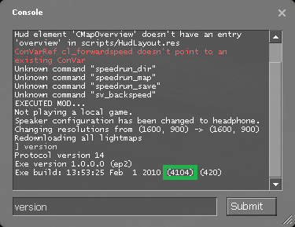
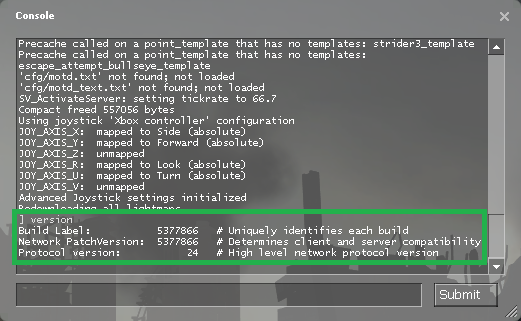
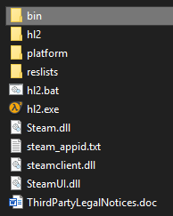
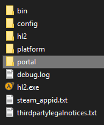

# speedrun_demorecord

## Summary
`speedrun_demorecord` is a simple plugin for games running on the Source Engine used to automatically record demos through map changes, save/loads, and deaths.

## Supported Engines
There have been many updates to Source Engine since its release in 2004. Therefore, only widely available & used versions of Source Engine are supported. Please refer to the matrix below for supported games/engines.

## Installing

1. Find out what version of Source Engine you're using. Run the following command in console:

    **Unpack Example**:

    
    * Note the exact engine version number.

    **SteamPipe Example**:

    
    * No need to worry about specific numbers here, if the output looks like this it's most likely SteamPipe.

2. Download the correct DLL from the [releases](https://github.com/RedHaze/speedrun-demo-record-unified/releases) page according to this matrix. A **bold face** entry denotes a game that hasn't yet been tested but *should* work fine. An X denotes a game which hasn't been tested and/or is generally not used for speedrunning.

| Version        | Half-Life 2                      | Half-Life 2: Episode 1           | Half-Life 2: Episode 2           | Portal                       |
|----------------|----------------------------------|----------------------------------|----------------------------------|------------------------------|
| 3420           | X                                | X                                | X                                | speedrun_demorecord-2007.dll |
| 4044           | **speedrun_demorecord-2006.dll** | X                                | X                                | X                            |
| 4104           | X                                | X                                | speedrun_demorecord-2007.dll     | X                            |
| 5135           | speedrun_demorecord-2007.dll     | **speedrun_demorecord-2007.dll** | **speedrun_demorecord-2007.dll** | speedrun_demorecord-2007.dll |
| SteamPipe      | speedrun_demorecord-2013.dll     | **speedrun_demorecord-2013.dll** | **speedrun_demorecord-2013.dll** | speedrun_demorecord-2013.dll |

3. To install the plugin, move the DLL to the appropriate folder:

    **4044 or lower**

    Copy the DLL to the `bin` folder which is found in the same directory as `hl2.exe` e.g.:

    

    **4104 or higher (including SteamPipe)**

    Copy the DLL to the games respective folder. For example, for Portal, place the DLL in the root of the `portal` folder e.g.:

    

4. Ensure the plugin loads by executing one of the following according to the DLL downloaded:
    ```
    plugin_load speedrun_demorecord-2006.dll
    plugin_load speedrun_demorecord-2007.dll
    plugin_load speedrun_demorecord-2013.dll
    ```

    You should see the following output in console if the plugin loaded successfully:

5. To load the plugin as startup automatically, create the file `autoexec.cfg` in the game's config folder (e.g. `portal/cfg/autoexec.cfg`) and add the same `plugin_load` line used in step 4. This config file will automatically execute whenever you launch the game. Feel free to 

## Building & Running Tests
*Coming soon*

## Credits
* @Jukspa
* @YaLTeR
* @SizzlingCalamari
* @Gocnak
* @fatalis
