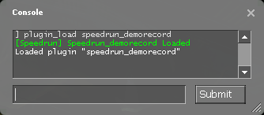

# speedrun_demorecord

## Summary
`speedrun_demorecord` is a simple plugin for games running on the Source Engine used to automatically record demos through map changes, save/loads, and deaths.

## Supported Engines
There have been many updates to Source Engine since its release in 2004. Therefore, only widely available & used versions of Source Engine are supported. Please refer to the matrix below for supported games/engines.

## Installing

1. Find out what version of Source Engine you're using. Run the following command in console:

    **Unpack Example**:

    
    * Note the exact engine version number.

    **SteamPipe Example**:

    
    * No need to worry about specific numbers here, if the output looks like this it's most likely SteamPipe.

2. Download the correct DLL from the [releases](https://github.com/RedHaze/speedrun-demo-record-unified/releases) page according to this matrix. A **bold face** entry denotes a game that hasn't yet been tested but *should* work fine. An X denotes a game revision which hasn't been tested, is generally not used for speedrunning, and/or does not exist.

| Version        | Half-Life 2                      | Half-Life 2: Episode 1           | Half-Life 2: Episode 2           | Portal                       |
|----------------|----------------------------------|----------------------------------|----------------------------------|------------------------------|
| 3420           | X                                | X                                | X                                | speedrun_demorecord-2007.dll |
| 4044           | **speedrun_demorecord-2006.dll** | **speedrun_demorecord-2006.dll** | X                                | X                            |
| 4104           | X                                | X                                | speedrun_demorecord-2007.dll     | X                            |
| 5135           | speedrun_demorecord-2007.dll     | **speedrun_demorecord-2007.dll** | **speedrun_demorecord-2007.dll** | speedrun_demorecord-2007.dll |
| SteamPipe      | speedrun_demorecord-2013.dll     | **speedrun_demorecord-2013.dll** | **speedrun_demorecord-2013.dll** | speedrun_demorecord-2013.dll |

3. To install the plugin, move the DLL to the appropriate folder:

    **4044 or lower**

    Copy the DLL to the `bin` folder which is found in the same directory as `hl2.exe` e.g.:

    

    **4104 or higher (including SteamPipe)**

    Copy the DLL to the games respective folder. For example, for Portal, place the DLL in the root of the `portal` folder e.g.:

    

4. Ensure the plugin loads by executing one of the following according to the DLL downloaded:
    ```
    plugin_load speedrun_demorecord-2006.dll
    plugin_load speedrun_demorecord-2007.dll
    plugin_load speedrun_demorecord-2013.dll
    ```

    You should see the following output in console if the plugin loaded successfully:

    

5. To load the plugin as startup automatically, create the file `autoexec.cfg` in the game's config folder (e.g. `portal/cfg/autoexec.cfg`) and add the same `plugin_load` line used in step 4. This config file will automatically execute whenever you launch the game.

## Using `speedrun_demorecord`
After loading the plugin, the following console commands will become available:

* `speedrun_map`
  * When `speedrun_start` is called, the map given in this convar will be loaded and autorecording will start.
* `speedrun_dir`
  * Sets the directory of where demos will record to. By default, it's the game's root directory. To set a custom directory relative to the game's root directory, set this convar appropriately. The `speedrun_dir` MUST reside in the game's root directory.
* `speedrun_start`
  * Starts the map as set by `speedrun_map` *or* starts from a save as set by `speedrun_save` and enables autorecord. Demos will now record after every new map, death, reload, etc. Autorecord will stay enabled until `speedrun_stop` is executed.
* `speedrun_stop`
  * Disables autorecord and stops the currently recording demo.
* `speedrun_segment`
  * Records a demo after every death, reload, map change, etc with the same name. The demo will be overwritten after every reload.
* `speedrun_resume`
  * If your game crashes during a run, launch the game, execute this command, then reload your last save. Auto record will re-activate.
* `speedrun_bookmark`
  * While autorecord is enabled, you can call this command to have the current tick of the demo being recorded saved to the file `speedrun_democrecord_bookmarks.txt` located in `speedrun_dir`.
* `speedrun_save`
  * If empty, `speedrun_start` will start using the map set by `speedrun_map`. If `speedrun_save` is specified, `speedrun_start` will start using the specified save instead of a map. If the specified save does not exist, the speedrun will start using `speedrun_map`. The specified save must exist in the `SAVE` folder.
* `speedrun_version`
  * Prints plugin version to console.

## Building & Running Tests
*Coming soon*

## Credits
* [Jukspa](https://github.com/Jukspa)
* [YaLTeR](https://github.com/YaLTeR)
* [SizzlingCalamari](https://github.com/SizzlingCalamari)
* [Gocnak](https://github.com/Gocnak)
* [fatalis](https://github.com/fatalis)
